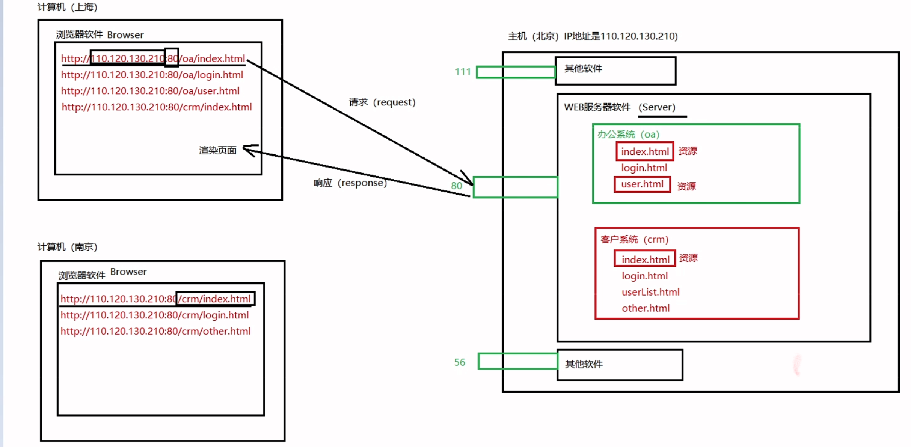

# Servlet：系统架构&B/S通信原理

## 一、关于系统架构

1. 系统架构包括什么形式？
    - **C/S架构**
    - **B/S架构**
2. C/S架构？
    - Client / Server（客户端 / 服务器）
    - C/S架构的软件或者说系统有哪些呢？
        - QQ（通过安装特定的软件客户端才能使用的软件）
    - C/S架构的特点：需要安装特定的客户端软件。
    - C/S架构的系统优点和缺点分别是什么？
        - 优点：
            - 速度快（软件中的数据大部分都是集成到客户端软件当中的，很少量的数据从服务器端传送过来，所以C/S结构的系统速度快）
            - 体验好（速度又快，界面又酷炫，当然体验好了。）
            - 界面酷炫（专门的语言去实现界面的，更加灵活。）
            - 服务器压力小（因为大量的数据都是集成在客户端软件当中，所以服务器只需要传送很少的数据量，当然服务器压力小。）
            - **安全**（因为大量的数据是集成在客户端软件当中的，并且客户端有很多个，服务器虽然只有一个，就算服务器那边地震了，火灾了，服务器受损了，问题也不大，因为大量的数据在多个客户端上有缓存，有存储，所以从这个方面来说，C/S结构的系统比较安全。）
            - .....
        - 缺点：
            - 升级维护比较差劲。（升级维护比较麻烦。成本比较高。每一个客户端软件都需要升级。有一些软件不是那么容易安装的。）
3. B/S架构？
    - B/S（Browser / Server，浏览器 / 服务器）
    - http://www.baidu.com
    - http://www.jd.com
    - http://www.126.com
    - B/S结构的系统是不是一个特殊的C/S系统？
        - 实际上B/S结构的系统还是一个C/S，只不过这个C比较特殊，这个Client是一个固定不变浏览器软件。
    - B/S结构的系统优点和缺点是：
        - 优点：
            - 升级维护方便，成本比较低。（只需要升级服务器端即可。）
            - 不需要安装特定的客户端软件，用户操作极其方便。只需要打开浏览器，输入网址即可。
        - 缺点：
            - 速度慢（不是因为带宽低的问题，是因为所有的数据都是在服务器上，用户发送的每一个请求都是需要服务器全身心的响应数据，所以B/S结构的系统在网络中传送的数据量比较大。）
            - 体验差（界面不是那么酷炫，因为浏览器只支持三个语言HTML CSS JavaScript。在加上速度慢。）
            - 不安全（所有的数据都在服务器上，只要服务器发生火灾，地震等不可抗力，最终数据全部丢失。）
            - ....
4. C/S和B/S结构的系统，哪个好，哪个不好？
    - 不同结构的系统在不同的业务场景下有不同的适用场景。
    - 娱乐性软件建议使用？
        - C/S 结构
    - 公司内部使用的一些业务软件建议使用？
        - 公司内部使用的系统，需要维护成本低。
        - 公司内部使用的系统，不需要很酷炫。
        - 公司内部使用的企业级系统主要是能够进行数据的维护即可。
        - B/S 结构。
5. 注意了：开发B/S结构的系统，其实就是开发网站，其实就是开发一个WEB系统。
    - 开发一个WEB系统你需要会哪些技术？
        - WEB前端（运行在浏览器上的程序。）
            - HTML
            - CSS
            - JavaScript
        - WEB后端（WEB服务器端的程序。）
            - Java可以（Java做WEB开发我们称为JavaWEB开发。JavaWEB开发最核心的规范：Servlet【Server Applet服务器端的Java小程序。】）
            - C语言也可以
            - C++也可以
            - Python也行
            - PHP也可以
            - ....
6. JavaEE是什么？
    - Java包括三大块：
        - JavaSE
            - Java标准版（一套类库：别人写好的一套类库，只不过这个类库是标准类库，走EE，或者走ME，这个SE一定是基础，先学。）
        - JavaEE（WEB方向，WEB系统。）
            - Java企业版（也是一套类库：也是别人写好的一套类库，只不过这套类库可以帮助我们完成企业级项目的开发，专门为企业内部提供解决方案的一套（多套）类库。）
            - 别人写好的，你用就行了，用它可以开发企业级项目。
            - 可以开发web系统。
            - Java比较火爆的就是这个JavaEE方向。
        - JavaME
            - Java微型版（还是一套类库，只不过这套类库帮助我们进行电子微型设备内核程序的开发）
            - 机顶盒内核程序，吸尘器内核程序，电冰箱内核程序，电饭煲内核程序。。。。。
    - JavaEE实际上包括很多种规范，13种规范，其中Servlet就是JavaEE规范之一。学Servlet还是Java语言。

## 二、B/S结构的系统通信原理（没有涉及到Java小程序）

### 2.1 WEB系统的访问过程

1. 第一步：打开浏览器
2. 第二步：找到地址栏
3. 第三步：输入一个合法的网址
4. 第四步：回车
5. 第五步：在浏览器上会展示响应的结果。

### 2.2  **关于域名：**

- https://www.baidu.com/ （网址）
- www.baidu.com 是一个域名
- 在浏览器地址栏上输入域名，回车之后，域名解析器会将域名解析出来一个具体的IP地址和端口号等。
- 解析结果也许是：http://110.242.68.3:80/index.html
### 2.3  **IP地址是什么？**

- 计算机在网络当中的一个身份证号。在同一个网络当中，IP地址是唯一的。
- A计算机要想和B计算机通信，首先你需要知道B计算机的IP地址，有了IP地址才能建立连接。
### 2.4  **端口号是什么？**

- 一个端口代表一个软件（一个端口代表一个应用，一个端口仅代表一个服务）。
- 一个计算机当中有很多软件，每一个软件启动之后都有一个端口号。
- 在同一个计算机上，端口号具有唯一性。

### <a id="section1"> 2.5  **一个WEB系统的通信原理** </a>

1. 第一步：用户输入网址（URL）
2. 第二步：域名解析器进行域名解析：http://110.242.68.3:80/index.html
3. 第三步：浏览器软件在网络中搜索110.242.68.3这一台主机，直到找到这台主机。
4. 第四步：定位110.242.68.3这台主机上的服务器软件，因为是80端口，可以很轻松的定位到80端口对应的服务器软件。
5. 第五步：80端口对应的服务器软件得知浏览器想要的资源名是：index.html
6. 第六步：服务器软件找到index.html文件，并且将index.html文件中的内容直接输出响应到浏览器上。
7. 第七步：浏览器接收到来自服务器的代码（HTML CSS JS）
8. 第八步：浏览器渲染，执行HTML CSS JS代码，展示效果。
### 2.6  什么是URL？
- 统一资源定位符（http://www.baidu.com）
### 2.7 什么是请求，什么是响应？
- 请求和响应实际上说的是数据的流向不同。
- 从Browser端发送数据到Server端，我们称为请求。英语单词：request
- 从Server端向浏览器Browser端发送数据，我们称为响应。英语单词：response
- B --> S （请求request）
- S --> B （响应response）

---
> [!IMPORTANT]
>
>[WEB系统的通信原理](#section1)

